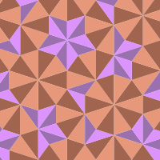

# SubstitutionTilings

[![][docs-development-img]][docs-development-url]

This package contains code to display substitution tilings and compute frequencies of patches in them. Specific examples, like the Fibonacci and Penrose tilings, are worked out.