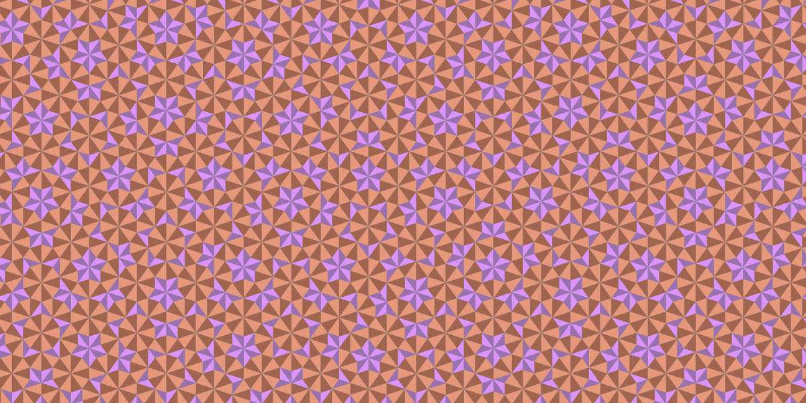

# SubstitutionTilings



[![][docs-development-img]][docs-development-url]

**SubstitutionTilings.jl** is a Julia package designed for the exploration, generation, and analysis of substitution tilings. It provides tools for generating large patches of tilings through substitution rules, visualizing them, and computing statistical properties such as patch frequencies.
The package currently includes implementations for several well-known substitution systems:

- **Penrose P2**
- **Ammann-Beenker**
- **Chair**
- **Pinwheel**: A substitution system where tiles appear in infinitely many orientations.
- **Nilpotent**: A substitution system in the Heisenberg group

## Installation

This package is not yet registered in the General registry. You can install it directly from GitHub:

```julia
using Pkg
Pkg.add(url="https://github.com/DanRocag/SubstitutionTilings.jl")
```